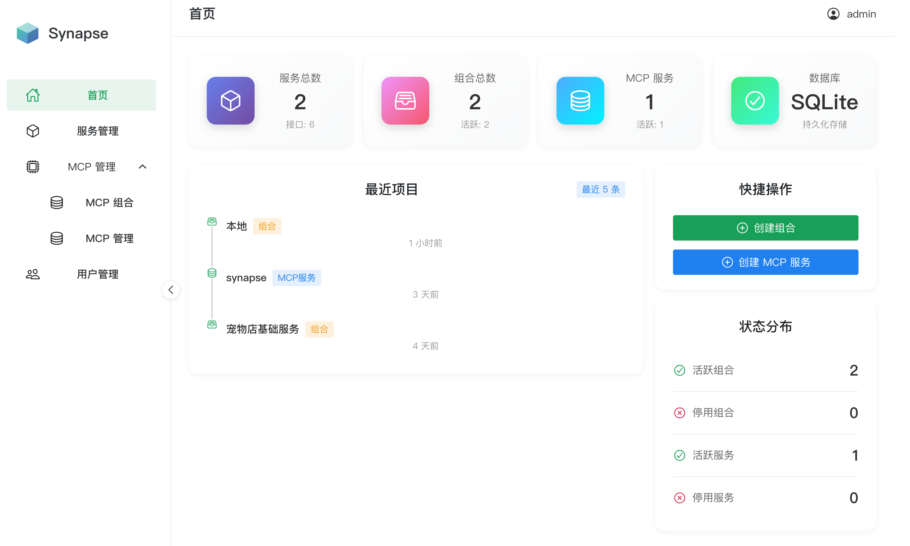
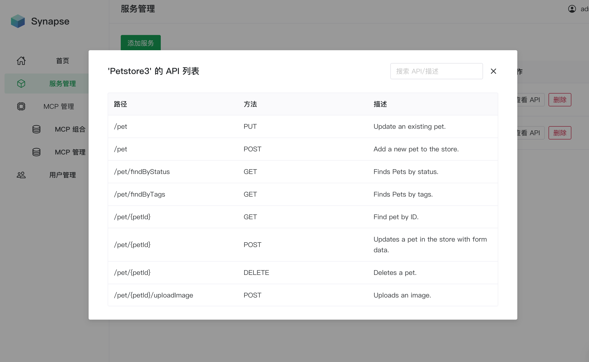
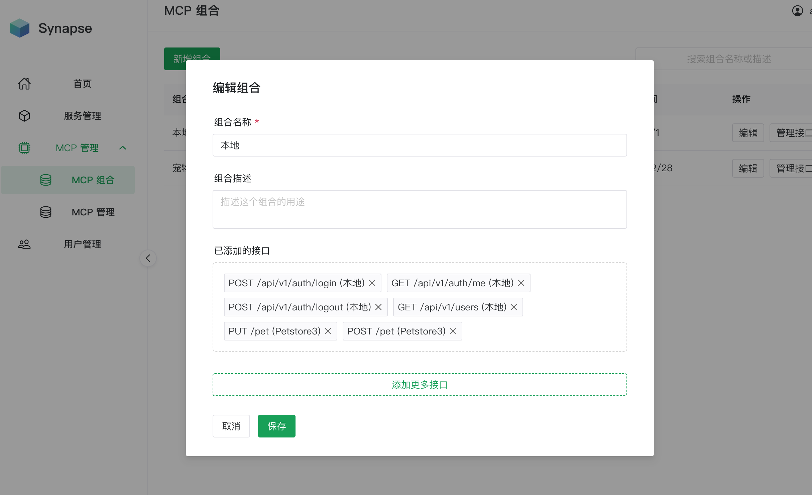
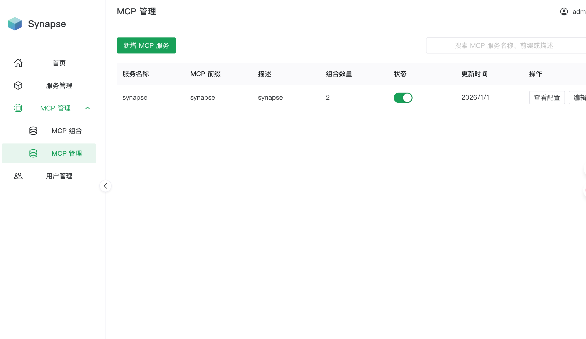

~~# Synapse

**让你传统项目上的 REST API 秒变 MCP Servers**

[简体中文](README.md) | [English](README_en.md)

Synapse 是一个零侵入的 API 适配层，它能直接解析 OpenAPI/Swagger 文档，动态生成符合 Model Context Protocol (MCP)
规范的服务端点。无需修改业务逻辑，无需迁移网关，一行命令，让 AI 智能体立即拥有操作现有业务系统的能力。

---

## 🚀 为什么选择 Synapse?

- **🤝 广泛的生态兼容**。 只要有 Swagger/OpenAPI 文档，就可以无缝接入。

- **🔌 告别繁琐的手动封装**。快速地将服务中的接口，自由组合成一个立马可用的 MCP Server。

- **🛡️ 零侵入式架构**。 不需要迁移网关，也不需要修改现有业务代码。它像一个“旁路挂件”，你的架构无需为 AI 做出伤筋动骨的改造。

- **⚡️ 极速与轻量化**。没有复杂的外部依赖，也无需部署沉重的网关服务。

## ✨ 核心特性

* **动态协议转换**: 实时将 OpenAPI Schema 转换为 MCP 工具定义，自动处理复杂参数和引用。
* **可视化管理控制台**: 基于 Vue 3 + Naive UI 构建的现代化响应式仪表板，用于管理微服务、编排工具包和监控系统状态。
* **逻辑编排**:
    * **组合 (Combinations)**: 将来自不同服务的特定端点分组为逻辑单元 (例如，“客户支持工具包”)。
    * **MCP 服务 (MCP Servers)**: 将组合打包成具有唯一前缀的独立 MCP 服务端点 (例如 `http://.../mcp/finance`)。
* **实时更新**: 基于 SSE 的通知机制确保连接的 AI 客户端即时收到工具列表变更，无需轮询或重启。
* **强大的安全性**: 管理接口采用 RBAC 和 JWT 认证 (`admin`/`user` 角色)，同时保持 MCP 协议端点针对 Agent 访问的优化与开放。
* **灵活的持久化**: 开箱即用的 SQLite 零配置设置，并通过 SQLAlchemy 和 Alembic 轻松扩展支持企业级 SQL 数据库。

## 🛠️ 技术栈

* **后端**: Python 3.12+, FastAPI
* **前端**: Vue 3, TypeScript, Vite, Naive UI
* **协议**: Model Context Protocol (MCP) v1 (HTTP + SSE 传输)。

## 演示






## ⚡ 快速开始

### 前置条件

* **Python 3.12+** (推荐使用 `uv` 包管理器)
* **Node.js 20+** (推荐使用 `pnpm`)

### 1. 后端设置

```bash
cd backend
uv sync

# 默认管理员账户: admin / admin123
uv run uvicorn main:app --reload --host 0.0.0.0 --port 8000
```

### 2. 前端设置

```bash
cd frontend
pnpm install
pnpm run dev
```

访问管理控制台：`http://localhost:5173`。

## 🔌 客户端集成

只需几秒钟即可将您的 AI 工具连接到 Synapse 的 MCP Severs。

**端点格式:** `http://ip:port/mcp/{server_prefix}`

### MCP 配置

将以下内容添加到您的 MCP 设置中：

```json
{
  "mcpServers": {
    "name-prefix": {
      "type": "sse",
      "url": "http://ip:port/mcp/synapse"
    }
  }
}
```

*注意: 请将 URL 中的 `synapse` 替换为您在 Synapse 仪表板中创建的 MCP 服务的具体前缀。*

---

## 🗺️ Roadmap

- [x] OpenAPI 3.0 / Swagger 2.0 解析支持

- [x] 可视化服务编排

- [x] 编排即 MCP 服务

- [x] 多数据库持久化支持

- [ ] Docker 一键部署镜像

- [ ] 支持更多鉴权方式 (OAuth2, API Key)

- [ ] 智能参数解析优化

## ❓ FAQ

Q: 这和 Nacos3.X / Higress 有什么区别？
> A: 定位不同。 Nacos/Higress 是重型基础设施网关，解决的是服务治理和高并发流量。Synapse 是轻量级适配器，解决的是“怎么让已有项目
> api 如何快速成为 Ai Tool ”的问题。Synapse 可以在你本地运行，无需改动现有基建。

